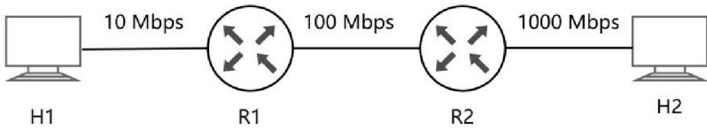
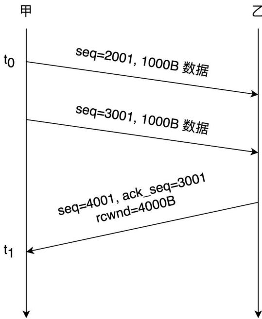
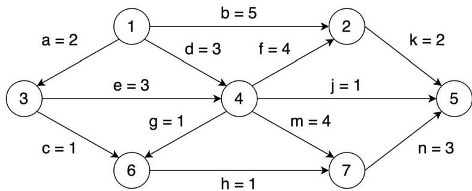
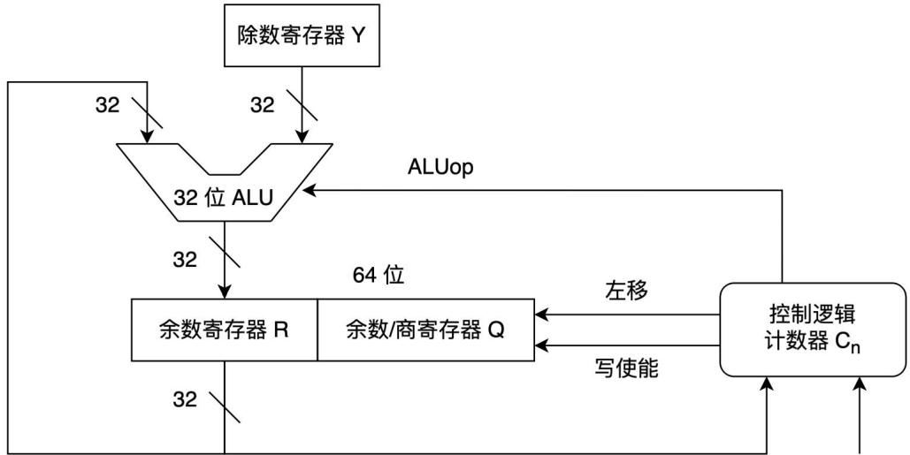
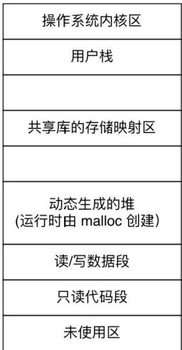
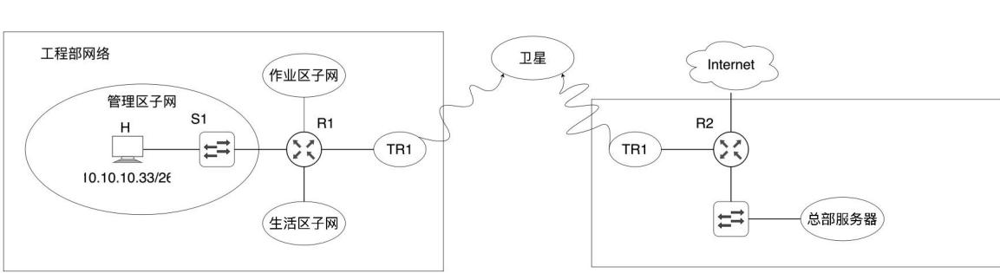

# 2025 年全国硕士研究生入学统一考试

## 计算机科学与技术学科联考计算机学科专业基础综合试题

## 一、单项选择题（第40小题，每小题2分，共80分。下列每题给出的四个选项中，只有一个选项最符合试题要求）

1. 以下代码的时间复杂度是（）。 
```c
int count = 0;
for (int i=0; i*i<n; i++)
    for (int j=0; j<i; j++)
    count++;
```    
**A**. O(log₂n)  
B. O(n)  
C. O(nlog₂n)  
D. O(n²) 

2. 对于括号匹配问题，符号栈初始为空，容量为3，下列表达式不能实现的是（）。  
A. $(\mathrm{a} + [\mathrm{b} + (\mathrm{c} + \mathrm{d})\mathrm{e}] + \mathrm{f}) + \mathrm{g} - \mathrm{h}$  
B. $[\mathrm{a}^{*}((\mathrm{b} + \mathrm{c}) / (\mathrm{d} - \mathrm{e}) + \mathrm{f} / \mathrm{g})] - \mathrm{h}$  
C. $[\mathrm{a}^{*}(\mathrm{b} - (\mathrm{c} - \mathrm{d})^{*}\mathrm{e} / (\mathrm{f} + \mathrm{g})) - \mathrm{h}]$  
**D**. $[\mathrm{a} - (\mathrm{b} + [\mathrm{c}^{*}(\mathrm{d} + \mathrm{e}) - \mathrm{f}] + \mathrm{g} + \mathrm{h})]$ 

3. 以下数组不能作为完全二叉树的是（）。  
A. 8, 10, 15, 20, 25, 30, 35  
B. 5, 9, 11, 14, 20, -1, -1  
C. 1, 3, 6, 9, 12, 15, 18  
**D**. 17, 20, 35, -1, 18, 45, -1, -1, 29, 2 

> [!note] 数组和完全二叉树的关系是什么？
> - **完全二叉树**：前面几层必须满，最后一层可以不满，但是左连续
> - **用完全二叉树表示的数组**：从上到下从左到右把节点元素的值依次写入数组

4. 下列关于二叉树及森林的叙述中，正确的是（）。  
A. 完全二叉树不存在度为1的结点  
**B**. 任意一个森林可以转换为一棵二叉树  
C. 二叉树的分支结点个数比叶结点个数少  
D. 链式树的根中保存的是最先计算的运算符 

[[408随笔#>4|链式树]]

5. 设字符集 S 包含 7 个字符，各字符出现的频次分别是 2, 3, 4, 6, 10, 11。为 S 中的各字符构造哈夫曼编码，编码长度不小于 3 的字符个数是（）。  
**A**. 2  
B. 3  
C. 4  
D. 5 

[[408随笔#>2025-5|哈夫曼编码]]

6. 下列关于图的叙述中，正确的是（）。  
A. 有向图必定存在入度为0的顶点  
B. 有向无环图的拓扑排序有序序列存在且唯一  
**C**. 各顶点的度均大于等于2的无向图必有回路  
D. 可用BFS算法求出带权图中的每一对顶点的最短路径 

7. 已知查找表中有 400 个元素，查找元素概率相同。采用分块查找法且均匀分块。若采用顺序查找法确定元素所在块，且块内也采用顺序查找法，为效率最高，每块包含元素应为（）。  
A. 8  
B. 10  
C. 20  
D. 25 

8. 给 7 个不同的关键字，能够构成不同 4 阶 B 树的个数为（）。  
A. 7  
B. 8  
C. 9  
D. 10 

9. 下列关于散列法处理冲突的叙述中，正确的是（）。  
A. 只要散列表不满，线性探查再散列一定能找到一个空闲位置  
B. 只要散列表不满，二次探查再散列一定能找到一个空闲位置  
C. 线性探查再散列处理的冲突，一定是发生在同义词之间  
D. 二次探查再散列处理的冲突，一定是发生在非同义词之间 

10. 下列排序算法中，最坏情况下移动次数最少的是（）。  
A. 冒泡排序  
B. 直接插入排序  
C. 快速排序  
D. 简单选择排序 

11. 对含 9 个关键字的初始序列进行排序，若序列的变化情况如下表所示，则下列排序算法中，采用的是（）。 

	<table><tr><td>初始序列</td><td>5, 25, 40, 30, 10, 20, 45, 15, 35</td></tr><tr><td>第 1 趟排序后的序列</td><td>5, 10, 20, 30, 15, 35, 45, 25, 40</td></tr><tr><td>第 2 趟排序后的序列</td><td>5, 10, 15, 25, 20, 30, 40, 35, 45</td></tr></table>

A. 希尔排序
B. 基数排序  
C. 归并排序  
D. 折半插入排序 

12. 在 32 位计算机上执行下列 C 语言代码:
```c
short si = -32767;
unsigned int ui = si; 
```
变量 ui 的值为（）。  
A. $2^{15} - 1$  
B. $2^{15} + 1$  
C. $2^{32} - 2^{15} - 1$  
D. $2^{32} - 2^{15} + 1$ 

13. 已知 float 型变量用 IEEE754 单精度浮点数格式表示。若 float 型变量 x 的机器数为 47300000H；则 x 的值为（）。  
A. $0.375 \times 2^{14}$  
B. $1.375 \times 2^{14}$  
C. $0.375 \times 2^{15}$  
D. $1.375 \times 2^{15}$ 

14. 假设8位字长的计算机中，两个带符号整数 $\mathbf{x}$ 和 $\mathbf{y}$ 的补码表示分别时 $\mathrm{x}_{\text{补}} = \mathrm{A}3\mathrm{H}$ ， $\mathrm{y}_{\text{补}} = 75\mathrm{H}$ ，则通过补码加减运算器得到的 $\mathrm{x - y}$ 的值及OF标志分别为（）。  
A. 24, 0  
B. 24, 1  
C. 46, 0  
D. 46, 1 

15. 某 32 计算机按字节编址，采用小端方式存放数据，编译器按边界对齐方式为下列 C 语言结构型数组变量 employee 分配储存空间。 

```c
struct record{
    int id;
    char name[10];
    int salary;
} employee[200]; 
```

数组 employee 的起始地址为 0000A0B0H, employee[1].id 的机器数为 12345678H，问 56H 的地址是多少？（）。  
A. 0000 A0C3H  
B. 0000 A0C4H  
C. 0000 A0C5H  
D. 0000 A0C6H 

16. 下列选项中，由指令体系结构（ISA）规定的是（）。  
A. 是否采用阵列乘法器  
B. 是否采用定长指令字格式  
C. 是否采用微程序控制器  
D. 是否采用单总线数据通路 

17. 下列关于 RISC 的说法，错误的是（）。  
A. 多采用硬连线方式实现控制器  
B. 通常采用 Load/Store 型指令设计风格  
C. 难以采用流水线数据通路实现微架构  
D. 多采用寄存器传递过程调用时的参数 

18. 下列关于 CPI 和 CPU 时钟周期的叙述中，错误的是（）。  
A. 不同类型指令的 CPI 可能不一样  
B. 程序的 CPI 与 Cache 缺失率无关  
C. 单周期 CPU 的时钟周期以最耗时指令所用的时间为准  
D. 流水线 CPU 的时钟周期以最长流水段所用时间为准 

19. 下列关于 CPU 中的数据通路和控制器的叙述中，错误的是（）。 

A. 通用寄存器组中应该包含程序计数器  
B. 控制器中一定包含指令操作码的译码电路  
C. 单周期CPU中的控制器比多周期CPU中的更简单  
D. 流水线CPU需解决数据相关和控制相关等冒险问题 

20. 某处理器总线采用同步，并行传输方式，每个总线时钟周期传送 4 次数据（quadpumped 技术），若该总线的工作频率为 1333MHz（实际单位是 MT/s，表示每秒传送 1333M/次），总线宽度为 64 位，则总线带宽约为（）。  
A. 10.665 GB/s  
B. 42.66 GB/s  
C. 85.31 GB/s  
D. 341.25 GB/s 

21. 下列设备中，适合采用 DMA 输入输出的设备是（）。  
I. 键盘  
II. 网卡  
III. 固态硬盘  

IV. 针十式打印机  
A. I、II  
B. II、III  
C. II、IV  
D. III、IV 

22. 下列选项中，会触发外部中断请求的事件是（）。  
A. DMA 传送结束  
B. 总线事务结束  
C. 页故障处理结束  
D. 执行断点指令 

23. 在采用页式虚拟存储管理方式的系统中，当发生上下文切换时，下列寄存器中操作系统不需要更新的是（）。  
A. 通用寄存器  
B. 页表基址寄存器  
C. 程序计数器  
D. 内核中断向量表基址寄存器 

24. 关于虚拟化技术，下列说法错误的是（）。  
A. 操作系统可以在虚拟机上运行  
B. 一台主机可以支持多个虚拟机  
C. VMM与操作系统特权级相同  
D. 通过虚拟机技术，可以用一台主机上模拟多种ISA 

25. 在优先权调度中，采用单链表保存进程就绪队列，高优先级进程在队头。若就绪队列长度为 n，则插入进程、选出进程的时间复杂度为（）。  
A. O(1), O(1)  
B. O(1), O(n)  
C. O(n), O(1)  
D. $O(n)$ , $O(n)$ 

26. 现有一 LRU 算法，采用固定分配局部置换的页面置换策略，已为进程分配 3 个页框，页面访问序列为 $\{0,1,2,0,5,1,4,3,0,2,3,2,0\}$ ，其中 0,1,2 已调入内存。则缺页次数是（）。  
A. 5  
B. 6  
C. 7  
D. 8 

27. 确定进程运行所需的最少页框数时，要考虑的指标是（）。  
A. 代码段长  
B. 虚拟地址空间大小  
C. 物理地址空间大小  
D. 指令系统支持的寻址方式 

28. 关于虚拟文件系统，下列说法正确的是（）。  
A. 虚拟文件系统是运行在虚拟内存的文件系统  
B. VFS 可以加快文件系统的访问速度  
C. VFS 定义了可访问不同文件系统的统一接口  
D. VFS 只能访问本地文件系统，不能访问网络文件系统 

29. 某文件系统采用索引节点方式。用户在目录中新建文件 F 时，文件系统不会做的是（）。  
A. 初始化文件 F 的索引节点  
B. 在目录文件中写入 F 的索引节点号  
C. 在目录文件中写入 F 的访问权限信息  
D. 在目录文件中增加一条文件 F 对应的目录项 

30. 关于内存映射文件，下列说法正确的是（）。  
I. 可实现进程间通信  
II. 实现了页面到磁盘块的映射  
III. 将文件映射到进程的虚拟地址空间  

IV. 将文件映射到系统的物理地址空间  
A. I、III  
B. I、IV  
C. II、III  
D. I、II、III 

31. 下列选项中，可被文件系统用于外存空间使用情况的是（）。  
A. 目录  
B. 系统打开文件表  
C. 文件分配表（FAT）  
D. 进程控制块（FCB） 

32. 下列选项中，文件系统能为温彻斯特硬盘和固态硬盘提供的功能是（）。 

A. 划分扇区  
B. 确定盘块大小  
C. 降低寻道时间  
D. 实现均衡磨损 

33. H1、H2 之间按电路交换方式、报文交换方式、分组交换方式传送 $2\mathrm{MB}(1\mathrm{M}=10^{6})$ 文件。接收文件全部内容所需时间记为 $T_{cs}$ 、 $T_{ms}$ 、 $T_{ps}$ 问这三个耗时的大小关系是（）。 



A. $\mathrm{T_{cs} > T_{ms} > T_{ps}}$  
B. $\mathrm{T_{ms} > T_{ps} > T_{cs}}$  
C. $\mathrm{T_{ms} > T_{cs} > T_{ps}}$  
D. $\mathrm{T_{ps} > T_{ms} > T_{cs}}$ 

34. 某差错编码的编码集为{10011010，01011100，11110000，00001111}，其检错和纠错能力是（）。  
A. 可以检测不超过2位错，检错率 $100\%$ ；可纠正不超过1位错  
B. 可以检测不超过2位错，检错率 $100\%$ ；可纠正不超过2位错  
C. 可以检测不超过3位错，检错率 $100\%$ ；可纠正不超过1位错  
D. 可以检测不超过3位错，检错率 $100\%$ ；可纠正不超过2位错 

35. 现有一 10BaseT 以太网，甲乙处于同一个冲突域，连续发生 11 次冲突，甲再次发送的最大时间间隔为（）。  
A. $0.512 \mathrm{~ms}$  
B. $0.5632 \mathrm{~ms}$  
C. $52.3776 \mathrm{~ms}$  
D. $104.8064 \mathrm{~ms}$ 

36. 一台新接入网络的主机 H 通过 DHCP 服务器动态请求 IP 地址过程中，与 DHCP 服务器交换 DHCP 报文过程如下图所示。封装 DHCP 的 REQUEST 报文的 P 数据报的目的 IP 地址和源 IP 地址分别是（）。  
A. 192.168.5.1, 0.0.0.0  
B. 192.168.5.1, 192.168.5.9  
C. 255.255.255.255, 0.0.0.0  
D. 255.255.255.255, 192.168.5.9 

37. 假设路由器实现 NAT 功能，内网中主机 H 的 IP 地址为 192.168.1.5/24。若 H 运行某应用向 Internet 发送一个 UDP 报文段，则路由器在转发封装该 UDP 报文段的 IP 数据报的过程中，UDP 报文的首部字段会被修改的是（），
I. 源端口号    II. 目的端口号
III. 总长度    IV. 校验和
A. ll、III  
B. I、IV  
C. ll、III  
D. II、IV 

38. 主机甲通过 TCP 向主机乙发送数据的部分过程如下图，seq 为序号，ack-seq 为确认序号，rcwnd 为接收窗口。甲在 $t_{0}$ 时刻的拥塞窗口和发送窗口均为 2000B，拥塞控制阈值为 8000B，MSS=1000B。甲始终以 MSS 发送 TCP 段。若甲在 $t_{1}$ 时刻收到如图所示的确认段，则甲在未收到新的确认段之前，还可以继续向乙发送的 TCP 段数是（）。 



A. 2  
B. 3  
C. 4  
D. 5 

39. Time 是一个提供时间查询服务的 C/S 架构网络应用，支持客户通过 UDP 和 TCP 向 Time 服务器请求时间。若某客户与 Time 服务器通信往返时间为 8ms，则该客户分别通过 UDP 和 TCP 向该服务器请求服务，所需的最少时间分别是（）。  
A. 8ms, 8ms  
B. 8ms, 16ms  
C. 16ms, 8ms  
D. 16ms, 16ms 

40. 关于 POP3 的说法，正确的是（）。  
I. 支持用户代理从邮件服务器读取邮件  
II. 支持用户代理向邮件服务器发送邮件  
III. 支持邮件服务器之间发送与接收邮件  
IV. 支持一条 TCP 连接收取多封邮件  
A. I、IV  
B. II、III  
C. I、II、III  
D. I、III、IV 

41. （13 分）有两个长度均为 n 的一维整型数组 A[n]、res[n]，计算 A[i] 与 A[i] (0 ≤ i ≤ j ≤ n-1) 乘积的最大值，并将其保存到 res[i] 中。若 A[] = {14, -9, 6}，则得到 res[] = {6, 24, 81, 36}。现给定数组 A，请设计时间空间上尽可能高效的算法 CalMulMax，求 res 中各元素的值。函数原型为：void CallMulMax(int A[], int res[], int n)。 

(1) 给出算法的基本思想。 

(2) 用 C/C++ 描述算法关键之处给出注释。 

(3) 说明时间、空间复杂度。 

42. （10 分）下图是一个 AOE 网，描述了 12 个工程活动及持续时间。 




(1) 完成该工程的最短时间是多少?哪些是关键活动? 

(2) 若以最短时间完成工程，则与活动 $\mathbf{e}$ 同时进行的活动可能有哪些？ 

(3) 时间余量最大的活动是哪个? 其时间余量是多少? 

(4) 假设工程从时刻 0 启动，因某种原因，活动 b 在时刻 6 开始，为保证工程不延期,在其它活动持续时间保持不变的情况下，b 的持续时间最多是多少?若不改变 b 的持续时间，则压缩哪个活动的持续时间也能保证工程不延期? 

43. （13 分）计算机 M 字长为 32 位，按字节编址，数据 cache 的数据区大小为 32KB，采 8 路组相联，主存块大小为 64B，cache 命中时间为 2 个时钟周期，缺失损失为 200 个时钟周期，采用页式虚拟存储，页大小为 4KB。数组 d 的起始地址为 0180 0020H (VA31 ~ VA0)。 

1) 主存地址中的 Cache 组号，块内地址分别占几位? VA 中哪些位可以作为 Cache 索引。 

2) d[100]的 VA 是多少? d[100] 所在主存块中对应的 Cache 组号是多少? 

3) 设代码已经在 cache 中, i, x 已装入内存, 但不在 cache, 则 d[0]在其主存块内的偏移量是多少? 执行 for 的过程中, 访问 d 的 Cache 缺失率和数组元素的平均访问时间分别是多少? (缺失率用百分比表示, 保留两位小数) 

4) d 分布在几个页中？若代码已在主存，d 不在主存，则执行 for 的过程中，访问 d 所引起的缺页次数是？ 

```txt
int x, d[2048], i;
for(i=0;i<2048;i++)
    d[i]=d[i]/x; 
```

44. （10分）接上题，R0~R4为通用寄存器，SEXT表示按符号扩展，M中补码除法器，逻辑结构图如下： 




机器级代码: 

```txt
// x 在 R2 中，i 在 R4 中
// 数组 d 的首地址在 R3 中
mov R1, (R3 + R4 * 4) // R1 ← d[i]
scov R1 // {R0, R1} ← SEXT(R1)
idiv R1 // R1 < -({R0, R1} / R2) 
```

(1) 若执行 idiv 指令时, d[i]=0x87654321, x=0xff, 则补码除法器中 R、Q、Y 的初始值分别为多少, (用十六进制表示)? 图 b 中哪个部分包含计数器? 在补码除法器执行过程中, ALUop 所控制的 ALU 运算有哪几种? 

(2) 假设 idiv 执行过程中会检测并触发除法异常, 则执行 idiv 指令时, 哪些情况下会发生除法异常 (要求给出此时 d[i] 和 x 的十六进制机器数)? 发生除法异常时, 在异常响应过程中, CPU 需要完成哪些操作? 

45. 三个人一起植树，甲挖坑，乙放树苗入坑并填土，丙负责为新种树苗浇水。步骤依次为：挖树坑，放树苗，填土和浇水。现在有铁锹和水桶各一个，铁锹用于挖树坑，填土。水桶用于浇水。当树坑数量小于3时，甲才可以挖树坑。设初始坑=0，铁锹水桶均可用，定义尽可能少的信号量，用 wait() 和 signal() 操作描述植树过程中三人的同步互斥关系，并说明所用信号量的作用及其初值。 

46. 某进程的虚拟地址空间如图所示，阴影部分为未占用区域，有 C 程序: 

```txt
char * ptr;
void main() {
    int length;
    ptr=(char*)malloc(100);
    scanf("%s", ptr);
    length = strlen(ptr);
    printf("length=%d\n", length);
    free(ptr);
} 
```




(1) 上述程序执行时，PCB 位于哪个区域，执行 scanf() 等待键盘输入时，该进程处于什么状态？ 

(2) main()函数的代码位于哪个区域？其直接调用的哪些函数的功能需要通过执行驱动程序实现？ 

(3) 变量 ptr 被分配在哪个区域？若变量 length 没有被分配在寄存器中，则会被分配在哪个区域？ptr 指向的字符串位于哪个区域？ 

47. 工程区网络中包含多个子网，并且通过卫星连接到总部服务器，网络架构如下图所示： 




TR1和TR2为全双工调制解调设备，卫星链路为R1，R2之间提供对称全双工信号，每个方向数据传输率为200kbps


(1) 忽略卫星信号中继，TR1，TR2 调制解调开销，则 R1 到 R2 之间的卫星链路单向传播时延是多少？主机 H 向总部服务器传输数据时可达到的最大吞吐量是多少？若忽略各层协议首部开销，以及以太网的传播时延，则 H→sever 上传一个 4000B 的文件，至少需要多长时间？ 

(2) 基于 GBN 为卫星链路设计单向可靠的链路层协议 SLP，支持 R1->R2' 发送数据。SLP 数据帧长 1500B，忽略 ACK 帧长度，要求 SLP 单向信道利用率不低于 80%，则发送窗口至少为?SLP 帧序号至少为多少？

(3) 总部给工程部分配 IP 地址空间 10.10.10.0/24，再划分为 3 个子网，生活区子网不少于 120 个，作业子网，管理区子网 IP 均不少于 60 个，H 已正确配置 IP。请问管理区子网和生活区子网的地址各是多少？