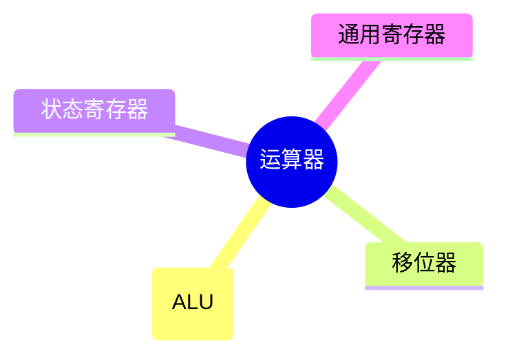

# 数制与编码

## [[计算机组成原理.pdf#page=32&selection=75,0,75,11|进位计数制及其相互转换]]

[[计算机组成原理.pdf#page=33&selection=44,0,46,39|为便于区分，常在数字后添加后缀字母来标识进制：B表示二进制数，O表示八进制数，D表示十进制数（通常省略），H表示十六进制数：此外，也常用前缀Ox表示十六进制数。]]

### [[计算机组成原理.pdf#page=33&selection=48,2,48,14|不同进制数之间的相互转换]]

[[计算机组成原理.pdf#page=33&selection=50,3,50,20|二进制数转换为八进制数和十六进制数]]
![[Pasted image 20260813122532.png]]
> [!PDF|]- [[计算机组成原理.pdf#page=33&selection=136,0,140,35|八进制和十六进制如何转化成二进制，如何互相转]]
> 反之，将八进制数或十六进制数转换为二进制数时，只需将每位数码分别替换为对应的3位或4位二进制数（必要时去掉整数最高位或小数最低位的0）。八进制数与十六进制数之间的转换，通常先转换为二进制数，再转为目标进制，这是最直接目不易出错的方式。


[[计算机组成原理.pdf#page=33&selection=142,3,142,15|任意进制数转换为十进制数]]
简单

[[计算机组成原理.pdf#page=34&selection=9,3,11,29|十进制数转换为任意进制数]]（以转二进制为例
![[Pasted image 20260813122815.png]]

---

## [[计算机组成原理.pdf#page=34&selection=146,0,146,9|定点数的编码表示]]

机器数就是电脑用0和1表示真值的那个编码，后面的各种码都是机器数

根据小数点位置是否固定，**有定点表示和浮点表示**

定点表示用于表示**定点小数和定点整数**
![[Pasted image 20260813121205.png]]
**硬件层面没有区别，靠软件协议实现区别**
换句话说，机器码不在乎自己存的是整数还是小数，只在乎存的是正数还是负数，区分机器码存的到底是正数还是小数，依赖程序如何进行解读。==作为机器码，我只知道，这里存了一个定点数==

>[!note] 本部分全且视作仅对整数的描述

- [[计算机组成原理.pdf#page=35&selection=61,4,61,8|原码表示法]]：与真值对应关系简单，乘除法方便，**但是零的表示方法不唯一**
- [[计算机组成原理.pdf#page=35&selection=91,3,91,8|补码表示法]]：加减法统一
- [[计算机组成原理.pdf#page=36&selection=38,1,38,5|变形补码]]：方便检测溢出，两位符号位
- [[计算机组成原理.pdf#page=36&selection=58,3,58,8|反码表示法]]：简单
- [[计算机组成原理.pdf#page=36&selection=68,3,68,8|移码表示法]]：简单

---
## [[计算机组成原理.pdf#page=37&selection=16,0,16,5|整数的表示]]

- 无符号数：略
- 有符号数：统一采用补码
---
## [[计算机组成原理.pdf#page=37&selection=52,7,52,20|C语言中的整数类型及类型转换]]

### 整数类型

- `short`：16位
- `int`：32位
- `long`：32 或 64，视系统位数而定

在前面加个`unsigned`即表示无符号数，==`unsigned`可以用作`unsigned int`的缩写==

无符号数和有符号数一起比较和运算时，中间结果和最终结果一律视作无符号数解释

### [[计算机组成原理.pdf#page=37&selection=84,2,84,11|整型数据的类型转换]]

定点数在类型转换中若涉及到字长变化，会触发以下操作
- **位截断**：长类型变短类型时，丢弃高位保留低位，可能导致数值变化
- **位拓展**：发生于短类型变长类型，**包含零拓展和符号拓展（高位反复填充符号位）**

三种转换方式：略

# 运算方法和运算电路

## [[计算机组成原理.pdf#page=44&selection=79,0,79,6|基本运算部件]]



| 运算       |   常见符号   | 含义        | LaTeX 写法           |
| :------- | :------: | :-------- | :----------------- |
| 与 (AND)  | $\land$  | 两者都为真才为真  | `\land` 或 `\wedge` |
| 或 (OR)   |  $\lor$  | 至少一个为真即为真 | `\lor` 或 `\vee`    |
| 非 (NOT)  | $\lnot$  | 取反        | `\lnot` 或 `\neg`   |
| 异或 (XOR) | $\oplus$ | 两者不同则为真   | `\oplus`           |

![[Pasted image 20260825131953.png]]
![[Pasted image 20260825132151.png]]
### [[计算机组成原理.pdf#page=45&selection=6,2,6,7|一位全加器]]

好理解，略
>[!notice] 并列书写表示与运算

### [[计算机组成原理.pdf#page=45&selection=30,2,30,9|串行进位加法器]]

n个一位全加器串联构成n位串行进位加法器
数越多，进位链越长，延迟越大。因此，缩短进位传递路径是提升加法器性能的关键

### [[计算机组成原理.pdf#page=45&selection=104,3,104,10|并行进位加法器]] ==重要==

[[计算机组成原理.pdf#page=45&selection=110,30,112,33|n个一位全加器被连接至一个 n位先行进位逻辑部件（CLA部件），以便几乎同时生成所有进位信号。]]
存在一种逻辑电路设计，能够用一次性表达清楚各个进位关系，而不需要通过信号链条进行传递，每个位可以同时向CLA发生信息并得到自己的信息

### [[计算机组成原理.pdf#page=46&selection=6,2,6,8|带标志加法器]]

针对判别正负性、溢出、判零等运算逻辑做了额外的逻辑电路
- `OF`：是否溢出
- `SF`：是否负数
- `ZF`：是否全零
- `CF`：无符号数加减是否溢出

---
## [[计算机组成原理.pdf#page=47&selection=27,0,27,8|定点数的移位运算]]

### 逻辑移位

将操作数视作无符号数
- 左移：高位移出，低位补0，高位的1移出则溢出
- 右移：低位移出，高位补0，低位的1移出则影响精度

### 算数移位

将操作数视作有符号整数（补码表示）
- 左移：高位移出，低位补0，若符号位变化则溢出
- 右移：低位移出，高位补符号位，若低位1移出则影响精度

---

## [[计算机组成原理.pdf#page=47&selection=107,0,107,8|定点数的加减运算]]

### [[计算机组成原理.pdf#page=47&selection=110,2,110,8|补码加减运算]]

- 加法减法最后都是补码的加法
- 符号位和数值位一起参与运算
- 运算结果**自动截断**为$n+1$位（模$2^{n+1}$），高位进位被抛弃

### [[计算机组成原理.pdf#page=48&selection=23,2,23,8|加减运算溢出判别方法]]

**何时溢出**？——得数绝对值比两个操作数都大的运算可能会溢出

**如何判断溢出？**（==异或门组成溢出判断电路==）
- `采用一位符号位`：$V=A_sB_s\bar{S_s}+\bar{A_s}\bar{B_s}S_s$
- `采用一位符号位并结合进位情况`：$V=C_n\oplus C_{n-1}$
- `采用双符号位`：$V=S_{s_1}\oplus S_{s_2}$  
==双符号位是`模4补码`，单符号位是`模2补码`，**前者是后者全方位提升**==
>[!danger] 这里的符号位都取自补码加法的符号位
>比如正数减去负数，变成补码加法以后就是正数加正数，两个符号位都是0而不是一个1一个0

### [[计算机组成原理.pdf#page=48&selection=66,2,66,8|加减运算电路]]

> [!PDF|] [[计算机组成原理.pdf#page=48&selection=70,0,72,8|计算机组成原理, p.48]]
> 在计算机中，无论是无符号数还是有符号数的加减运算，均采用同一套硬件电路实现，即“一套电路，两种语义“

![[2.2-运算方法和运算电路 2026-08-26 10.36.14.excalidraw]]
#### [[计算机组成原理.pdf#page=49&selection=0,3,0,12|加法运算的工作原理]]

#### [[计算机组成原理.pdf#page=49&selection=30,3,30,12|减法运算的工作原理]]

> [!PDF|] [[计算机组成原理.pdf#page=49&selection=66,0,70,14|计算机组成原理, p.49]]
> 运算器本身无法识别所处理的二进制串是有符号数还是无符号数。例如，0－1 = 00...0 ＋11...1 11..1，若解释为有符号数，对应值为-1，结果正确；若解释为无符号数，对应值为$2^n-1$（n位无符号数的最大值），与数学结果不符。

> [!danger] [[计算机组成原理.pdf#page=49&selection=85,1,89,57|无符号减法的解释]]

#### [[计算机组成原理.pdf#page=49&selection=72,3,72,11|各类标志位的含义]]

`ZF`：零标志位
`OF`：溢出标志，**仅对有符号数有意义**，
`SF`：符号标志，等于符号位的取值，**仅对有符号数有意义**
`CF`：进/借位标志，表示无符号数的进位借位状态，判断是否溢出，**仅对无符号数有意义**，$CF=Sub\oplus C_{out}$

#### [[计算机组成原理.pdf#page=50&selection=26,3,26,12|无符号数大小的比较]]

> [!PDF|] [[计算机组成原理.pdf#page=50&selection=38,3,40,35|计算机组成原理, p.50]]
> 判断规则如下：当ZF=1时（无须检查CF），说明A =B；当 ZF =0且 CF =O时， 说明A>B：当CF=1时（此时ZF必为0，无须额外检查），说明A<B。

#### [[计算机组成原理.pdf#page=50&selection=42,3,42,12|有符号数大小的比较]]

> [!note] [[计算机组成原理.pdf#page=50&selection=58,3,60,39|计算机组成原理, p.50]]
> 判断规则如下：当 ZF=1时，说明A=B；当ZF=O且 OF=SF（或$OF\oplus SF=0$）时， 说明A>B；当ZF=O且OF≠ SF（或$OF\oplus SF=1$ ）时，说明A<B。

### [[计算机组成原理.pdf#page=50&selection=72,3,74,4|原码的加减运算（了解即可）]]

---

## [[计算机组成原理.pdf#page=51&selection=16,0,16,8|定点数的乘除运算]]

### 乘法运算
#### [[计算机组成原理.pdf#page=51&selection=20,3,20,12|原码乘法的运算原理]]

数值位和符号位分开处理：
- 乘积的符号位由两个乘数的异或得到
- 数值位可归结为两个无符号数相乘

![[Pasted image 20260827104420.png|400]]

算式还是好理解的

硬件实现中，采用**部分积（部分位数乘完以后的积）右移**的方式进行计算机能理解的迭代转换

==部分积部分和乘数部分整体右移==

>[!note] 个人理解碎碎念
>其实跟整个竖式表达式是一个逻辑，只不过通过整体右移，既充分利用了寄存器的空间，又巧妙地让位置对齐。你之前的部分积右移，相对来讲下一个数的乘积不就左移了吗，所以其实是对的上的，最后经过n轮计算刚好乘积部分的个位对齐到了个位，皆大欢喜

要用`2n`位寄存器(n位数乘以n位数得数最多就是2n），初始化$p_0$=0

#### [[计算机组成原理.pdf#page=51&selection=110,3,110,15|无符号整数的乘法运算电路]]
![[2.2-运算方法和运算电路 2026-08-27 13.50.31.excalidraw]]

==实线是数据信号，虚线是控制信号==

如果计算完毕以后`P`部分不全为0说明溢出

#### [[计算机组成原理.pdf#page=52&selection=90,3,90,15|有符号整数的乘法运算电路]]

神奇的booth算法让符号位和数值位一起参与运算，直接生成补码形式的乘积

![[2.2-运算方法和运算电路 2026-08-27 14.25.30.excalidraw]]
若高32位的结果不是低32位的符号拓展，则判定溢出

### [[计算机组成原理.pdf#page=53&selection=59,3,59,14|乘法运算的三种实现方式]]
- `迭代式乘法器`
- `阵列乘法器`
- `移位-加减法`

---
## [[计算机组成原理.pdf#page=53&selection=77,2,77,6|除法运算]]

### 无符号整数除法运算原理

算式好理解，不过是将十进制除法竖式改成二进制

![[Pasted image 20260905091655.png]]

### 无符号整数除法电路

![[2.2-运算方法和运算电路 2026-09-05 09.20.17.excalidraw]]

比较好理解，写回的意思就是恢复什么都不做的状态

### 补码除法运算的工作原理

[[2.2.4_4 补码的除法运算.pdf#page=3&selection=2,0,2,10|补码除法：加减交替法]]

让符号位参与运算，自然得出结果

值得注意的是，在两人n位补码除法中，商溢出仅有一种情形：被除数为最大负数$-2^{n-1}$，且除数为-1，此时结果$2^{n-1}$无法用 n 位补码表示

# 浮点数的表示和运算

#浮点数

## 浮点数的表示

![[Pasted image 20260905155436.png]]

上面那个科学记数法表示的数字在二进制编码里可以表示成如下形式

![[Pasted image 20260905155421.png]]
![[Pasted image 20260905160405.png]]
$$
浮点数真值:r^E\times M
$$

阶码E反映浮点数的表示范围及小数点的实际位置； 尾数M的数值部分的位数n反映浮点数的精度(==尾数越大，能表示的数的集合越稠密！==)

### 浮点数尾数规格化

规定尾数最高位必须是有效值（类比科学计数法的底数必须是1到9，不能是0）

![[Pasted image 20260905160822.png]]

[[2.3.1_1 浮点数的表示.pdf#page=9&selection=97,0,97,36|注：采用“双符号位” ，当溢出发生时，可以挽救。更高的符号位是正确的符号]]

"挽救" = 双符号位在尾数加法越界时，靠更高那位 S1 保留了真实符号与方向信息，通过一次右规（尾数>>1，阶码+1）把本应"溢出作废"的中间结果重新规格化成合法浮点尾数，而不是丢弃/饱和。

### 规格化浮点数的特点

![[Pasted image 20260905161501.png]]

---
## IEEE 754

### 移码

![[Pasted image 20260905162237.png]]
![[Pasted image 20260905162309.png]]

当然偏置值也可以取其他值

### IEEE 754标准

![[Pasted image 20260905163253.png]]

隐藏表示是因为最高位肯定是1，这个都知道的东西就没必要占存储空间，算的时候拉进来就行了

---

## 浮点数的加减运算

![[Pasted image 20260905163937.png]]

### [[计算机组成原理.pdf#page=69&selection=41,2,41,4|舍入]] 听课吧，看不懂
#背诵 
- 保护位（四舍五入）
- 正向舍入
- 负向舍入
- 截断法

G/R/S 三个辅助位永远存在（在 FPU 硬件里是固定 3 个触发器），只是当被舍掉的低位不足 3 位时，更靠后的位"物理不存在"，按规则补 0 即可，判定表完全照样用，不矛盾。

```
保留 p 位      G    R    │  第p+3  第p+4  第p+5  ...  第p+k
                │    │    │  位      位      位          位
                │    │    │  └──────┴──────┴─────┴───→ 全部 OR 起来 = S
                │    │    └── R 结束，S 的管辖区从这里开始
                │    └── Round 位（单独拎）
                └── Guard 位（单独拎）
```
### 强制类型转换

![[Pasted image 20260905165052.png]]


