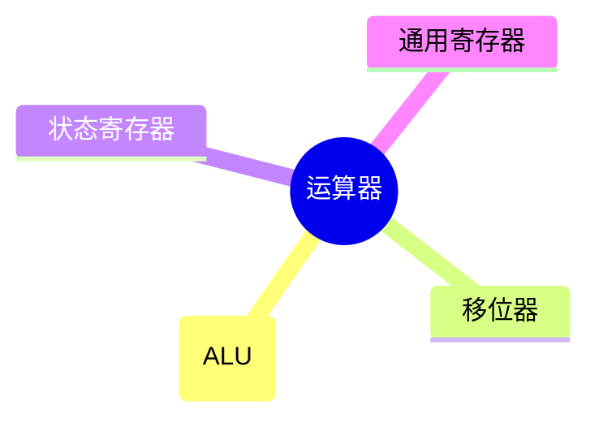

## [[计算机组成原理.pdf#page=44&selection=79,0,79,6|基本运算部件]]

| 运算       |   常见符号   | 含义        | LaTeX 写法           |
| :------- | :------: | :-------- | :----------------- |
| 与 (AND)  | $\land$  | 两者都为真才为真  | `\land` 或 `\wedge` |
| 或 (OR)   |  $\lor$  | 至少一个为真即为真 | `\lor` 或 `\vee`    |
| 非 (NOT)  | $\lnot$  | 取反        | `\lnot` 或 `\neg`   |
| 异或 (XOR) | $\oplus$ | 两者不同则为真   | `\oplus`           |

![[Pasted image 20260825131953.png]]
![[Pasted image 20260825132151.png]]
### [[计算机组成原理.pdf#page=45&selection=6,2,6,7|一位全加器]]

好理解，略
>[!notice] 并列书写表示与运算

### [[计算机组成原理.pdf#page=45&selection=30,2,30,9|串行进位加法器]]

n个一位全加器串联构成n位串行进位加法器
数越多，进位链越长，延迟越大。因此，缩短进位传递路径是提升加法器性能的关键

### [[计算机组成原理.pdf#page=45&selection=104,3,104,10|并行进位加法器]] ==重要==

[[计算机组成原理.pdf#page=45&selection=110,30,112,33|n个一位全加器被连接至一个 n位先行进位逻辑部件（CLA部件），以便几乎同时生成所有进位信号。]]
存在一种逻辑电路设计，能够用一次性表达清楚各个进位关系，而不需要通过信号链条进行传递，每个位可以同时向CLA发生信息并得到自己的信息

### [[计算机组成原理.pdf#page=46&selection=6,2,6,8|带标志加法器]]

针对判别正负性、溢出、判零等运算逻辑做了额外的逻辑电路
- `OF`：是否溢出
- `SF`：是否负数
- `ZF`：是否全零
- `CF`：无符号数加减是否溢出

---
## [[计算机组成原理.pdf#page=47&selection=27,0,27,8|定点数的移位运算]]

### 逻辑移位

将操作数视作无符号数
- 左移：高位移出，低位补0，高位的1移出则溢出
- 右移：低位移出，高位补0，低位的1移出则影响精度

### 算数移位

将操作数视作有符号整数（补码表示）
- 左移：高位移出，低位补0，若符号位变化则溢出
- 右移：低位移出，高位补符号位，若低位1移出则影响精度

---

## [[计算机组成原理.pdf#page=47&selection=107,0,107,8|定点数的加减运算]]

### [[计算机组成原理.pdf#page=47&selection=110,2,110,8|补码加减运算]]

- 加法减法最后都是补码的加法
- 符号位和数值位一起参与运算
- 运算结果**自动截断**为$n+1$位（模$2^{n+1}$），高位进位被抛弃

### [[计算机组成原理.pdf#page=48&selection=23,2,23,8|溢出判别方法]]

**何时溢出**？——得数绝对值比两个操作数都大的运算可能会溢出

**如何判断溢出？**
- `采用一位符号位`：$V=A_sB_s\bar{S_s}+\bar{A_s}\bar{B_s}S_s$
- `采用一位符号位并结合进位情况`：$V=C_n\oplus C_{n-1}$
- `采用双符号位`：$V=S_{s_1}\oplus S_{s_2}$
>[!danger] 这里的符号位都取自补码加法的符号位
>比如正数减去负数，变成补码加法以后就是正数加正数，两个符号位都是0而不是一个1一个0

### [[计算机组成原理.pdf#page=48&selection=66,2,66,8|加减运算电路]]

> [!PDF|] [[计算机组成原理.pdf#page=48&selection=70,0,72,8|计算机组成原理, p.48]]
> 在计算机中，无论是无符号数还是有符号数的加减运算，均采用同一套硬件电路实现，即“一套电路，两种语义“

![[2.2-运算方法和运算电路 2026-08-26 10.36.14.excalidraw]]
#### [[计算机组成原理.pdf#page=49&selection=0,3,0,12|加法运算的工作原理]]

#### [[计算机组成原理.pdf#page=49&selection=30,3,30,12|减法运算的工作原理]]

